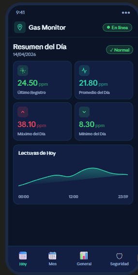
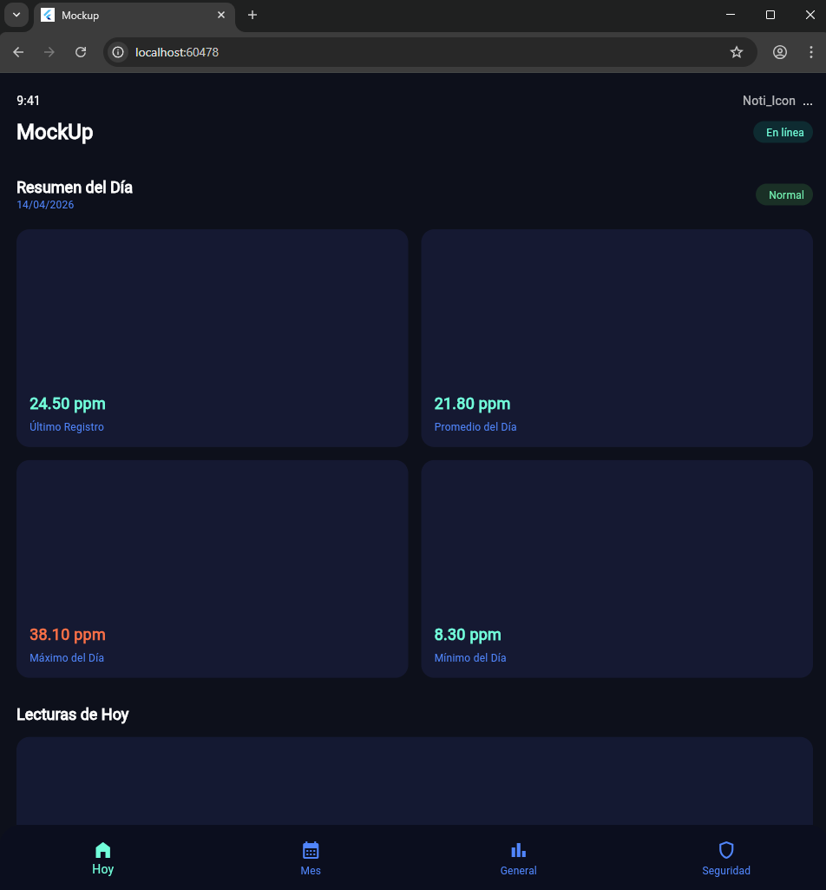

## Mockup

Este proyecto consiste en una réplica visual de una interfaz de monitoreo de gas desarrollada con el framework Flutter.

## Descripción del Proyecto

La aplicación es una pantalla única que presenta el estado actual de sensores de gas. El diseño se centra en la legibilidad de datos críticos y una estética tecnológica basada en tonos azules oscuros y acentos neón.

## Características Principales
- Interfaz de usuario en modo oscuro: Uso de una paleta de colores coherente con el diseño original (fondos azul profundo y tarjetas en tonos oscuros).
- Tarjetas de información: Cuatro secciones principales que muestran el último registro, el promedio, el valor máximo y el valor mínimo del día.
- Gráfico personalizado: Implementación de un gráfico de líneas fluido mediante el uso de CustomPainter de Flutter para simular las lecturas temporales.
- Componentes de estado: Etiquetas visuales para indicar si el sistema está en línea y si los niveles son normales.
- Navegación inferior: Barra de navegación con cuatro secciones (Hoy, Mes, General, Seguridad) siguiendo el estilo visual del diseño.

## Tecnologías Utilizadas

Lenguaje: Dart
Framework: Flutter
Widgets: CustomPaint, GridView, Scaffold, BottomNavigationBar

## Estructura del proyecto

lib/
├── main.dart                    ← Mockup

