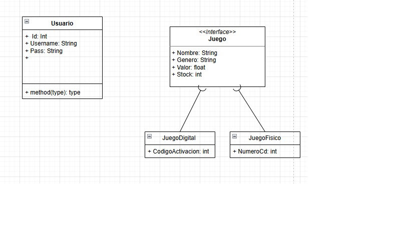

# Proyecto Final Aplicaciones Moviles.

Aplicación hecha en flutter que seguirá la rubrica definida en clase, La idea es hacer un Back sencillo con auth y base de datos relacional sencilla, Este repositorio tendra las dos partes de la app (Front, Back).

## Back-End

Hecho en ecosistema TypeSctipt/JavaScript con node usando librerias como Axios, JWT, SQLite

Se encargara de una autenticacion sencilla con JWT.

Administracion de Contenido usando SQLite y paginacion con el fin de mejorar los tiempos de respuesta (No veo necesario el usar cache (Redis) al ser un proyecto demo).

## Front-End

Hecho en Flutter